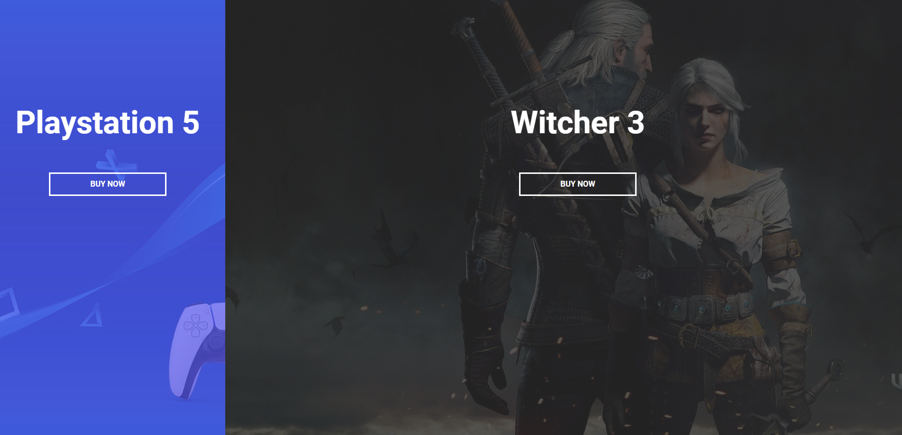

# Split Landing Page

This mini project is an integral part of my learning journey in HTML, CSS, and JavaScript. It was developed as a component of the "50 Projects in 50 Days - HTML, CSS & JavaScript" course by **Brad Traversy**, designed to enhance my proficiency through practical, hands-on experience.

## Screenshot

[Live Preview](https://milanilic-w28.github.io/split-landing-page/)

